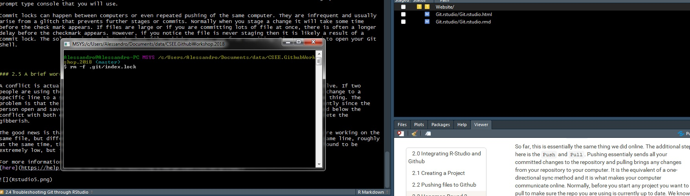

### 2.0 Integrating R-Studio and Github

Github as it is naturally operates similarly to Google Drive as we have discovered, but with that additional step of requiring a commit. However, where it truly gains its power is the level of integration it has with R. Github supports all operations that can be conducted on Rstudio. This includes generating reports, creating websites, and creating applications. Before we explore any of those topics further, we first need to understand how the basic operations are conducted. 

### 2.1 Creating a Project

R Studio allows for the creation of projects, which is an enclosed environment that files that are used and produced are kept in the same folder. For those of you that might be R-Users but do not use R Studio, this saves the effort that goes into specifying the file path or changing the working directory everytime you open or save a file. Step 1 let us open R and see what our interface looks like. 

You will likely have three panels open that on default are the R Console (Left), the connections panels (top right), and files/visualizer (bottom right). The R console works exactly like your standard R and is where you can type code or copy it from a script. Normally you would load a script to fit in the top left panel that will have all your analyses. The top right contains your environment with all your operations or datasets. However, it also has this **Git** tab that is how your Rstudio communications with your online repository. The bottom right is the repository file path. 

Let's open your Github repository on R Studio. First you need to go back to your Github repository online. Then click to get the website path using the clone repository button. 

Moving back to R Studio you will click through the following opens:
- File -> New Project
- Version Control
- Git
- Paste the website path into Repository URL

Once pasted you will have now copied all files from your online repository onto your computer. This will include the hangman file if you were Person A. This cloning would also work with other people's repository and is not limited to just yours. 

You will now see a newly generated tab in the communications panel in the top right of your console. There are a few items here that important and useful. First is the commit button that when you click on it will bring up another panel. This panel identifies files that have been modified and gives you the opportunity to stage them. The staging step is a way to tell R Studio that you are selecting these files to be commited. You should currently have it empty since you just downloaded the repository, everything should be up-to date. 

### 2.2 Pushing files to Github

Let's change that. Open your hangman file if you're **Person A**. If you are **Person B** or a third wheeler, create your open hangman file by going to File --> New File --> R Script and save it. Once the file is open, modify it or write something in it and then save. You should now see that file populate in the panel under Git. We are now going to commit it. 

The way to communicate between R Studio and Github has an additional step than the way we did it online. First, once a file has been modified, it will show in the communications panel with an "M". Click on it and then click commmit. This will bring up a separate panel like the one shown below. 

Here the page is broken into three main components. The top left shows a list of files that were modified. The associated letters mean the following:
- "A" is that a file has been added
- "M" is that the file has been modified (probably the one you will see most often)
- "D" is that the file has been deleted
- "?" is that a file has been added or modified, but is an format that is not recognizable to determine what the modification was. For example, a text file shows up as M when you change the text because Github understands replacing or adding some text with other text. However, its harder for Github to determine a change to a picture because of the complexity behind the file format. Instead only question mark appears to signal something has changed in regards to this file. 

The next step here is to click on the file you want to commit and click `stage`. This is the same thing as selecting a file in most other file managers. On the bottom panel, Git will try and identify what changes were made to the file. Here it is showing I have replaced line 176 with new text. In the top right panel we right the commit message just like we did online. Then we click `Commit`. 

So far, this is essentially the same thing we did online. The additional step here is the `Push` and `Pull`. Pushing essentialy sends all your committed changes to the repository and pulling brings any changes from your repository to your computer. It is the equivalent of a one-directional sync method and it is what makes your computer communicate online. Normally, before you start any project you want to pull to make sure the repo you are using is currently up to date. We know ours is currently update because we just cloned it a few minutes ago. That means we can push this recently modified file and have it populate online. If our repo was not to date, you will have a warning to pull first before you push. 
Congratulations, you have successfully synced your R Studio with Github!

### 2.3 Hangman Round 2

We are going to do this again, but this time all through the R Studio console. Step 1 will be for **Person B** to go online and clone **Person A** repository to their computer. Once cloned and opened in R, they need to do the following:

- Open the hangman file
- Make a change
- Open commit panel
- Stage the modified file
- Write a commit message
- Press `Commit`
- Push Repo

Then the other person's turn to `Pull` their current repository to make it up to date with the new change. Open the file and then complete the above steps. If all goes well you can do this on repeat without ever having to go near your web browser again. 
  
### 2.4 Troubleshooting Git through RStudio

There are intances where the R studio interface may not work properly with Github. Although they are rare, there are three specific occasions I have encountered frequently enough that I should mention here. These are

1. Large file issues
2. Commit locks
3. Undoing a commit

Github does not handle large files well or at all. Any single file over 25 mB will receive a warning for being too large and it simply will not handle a file over 100 MB. This is actually interesting because there is no size requirement in the actual repository and you can have repositories that are hundreds of GB in size. Just as long as no individual file exceeds 100 MB. Solutions? Well the easiest way is to split up the file. However, if that is not an option, then I recommend [Github LFS](https://git-lfs.github.com/). Unfortunately, I don't have the time to get too deep into how to use LFS, standing for Large File Storage, or how to install it. I recommend looking at the link though if that is an issue that applies to you. One key thing here is that LFS requires you to use the Git Shell rather than the R Studio interface. To access the shell you click on `More` under the Git tab in R Studio and then `Shell`. That will bring up a command prompt type console that you will use. 

Commit locks can happen between computers or even repeated pushing of the same computer. They are infrequent and usually arise from a glitch that prevents further stages or commits. Normally when you stage a change it will take some time before the check mark appears. If files are large or if you are committing lots of file at once, there is often a longer delay before the checkmark appears. However, if you notice the file is never staging then it is likely a result of a commit lock. The solution is to delete the lock file, which prevents you from commiting. First you need to open your Git Shell. Then type the following which removes the file index.lock

> rm -f .git/index.lock

You also perform regular operations through Git Shell. For example you can commit all your files and push them with the following files respectively

> git add -a commit "your message"

> git push 

On average the Shell tends to be faster than the GUI in R Studio. 

The final troubleshoot issue is undoing changes that have been commited before you have pushed. There are two ways to remove a commit, the soft way and the hard way. Soft resets delete the commit from your Github interface, but preserve the changes in your repository. This method in itself could be a troubleshooting strategy if you noticed a particular commit is causing problems. The way this is done is to reset the Github interface relative to the current stage of commits. The code below will conduct a soft reset of Git and will repopulate the modified changes into your Git tab on R Studio. 

> git reset --soft HEAD~1

Here `HEAD~1` means the commit before the current head. 

Let's try this an example. Made a modification to your hangman file, save it, and the file will populate in the Git panel in R Studio. Click on `Commit`, stage it, and add your message. Once it has been commited, open up the `Shell` and type the above command. What you will notice is that the change re-appears in your Git panel and the changes remain in the file you edited. 

The other type of reset is a hard reset. A hard reset will remove the commits in Git and ** WILL DELETE THE CHANGES IN YOUR WORKING DIRECTORY**. This can be a desired choice, especially when you have accidentally manipulated your code into a way that it no longer works and cannot be easily fixed. Reverting to the last commit is a key feature of version control and is similar to opening an older document. However, be careful because it can permanently delete a significant amount of work depending on the last time you committed to the repository.  

> git reset --hard HEAD~1

### 2.5 A brief word about conflicts

A conflict is actually somewhat difficult to accomplish, but when it does happen, is complicated to resolve. If two people are using the same repository and are working on it with the current version. One person makes a change to a specific line to a specific file, commits and pushes the file. Then the other person does the exact same thing. The problem is that the second person's edits are trying to be pushed into a file that has been updated recently since the person open and saved it. What typically happens is that the file writes two lines of gibberish above and below the conflict with both edits embeded in between. It is then up to the user who figure out what to do and delete the gibberish. 

The good news is that if you are working on different files in the repo this will not happen. Or if you're working on the same file, but different lines, this will not happen. It is only when working on the same file, on the same line, roughly at the same time, that a conflict will arise. The chances of this occurring with a collaborator I have found to be extremely low, but it can happen, so I have mentioned it here so you understand what that means. 

For more information on conflicts you can read it [here](https://help.github.com/articles/resolving-a-merge-conflict-on-github/)

