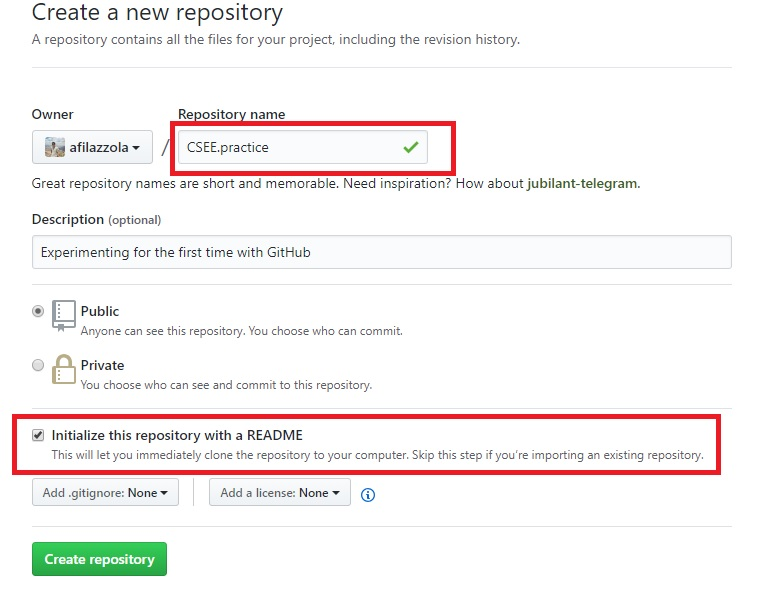
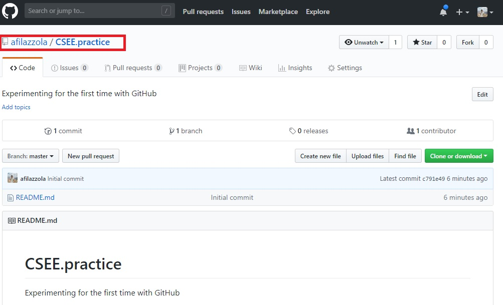
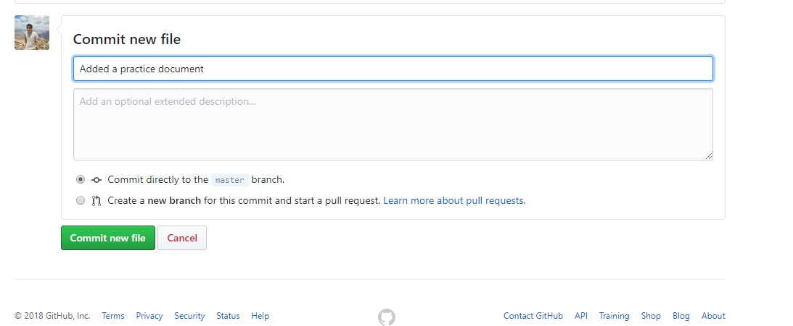
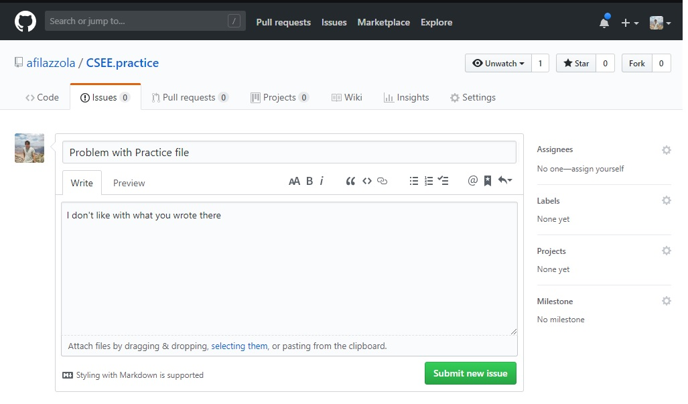
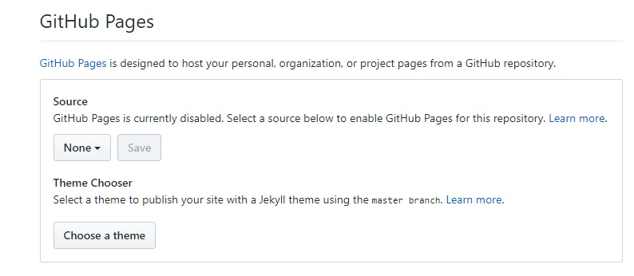
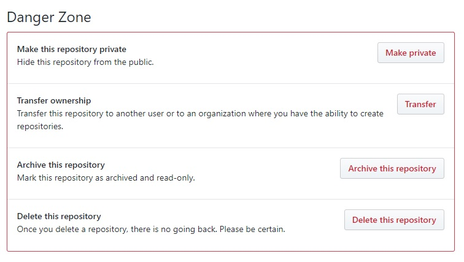
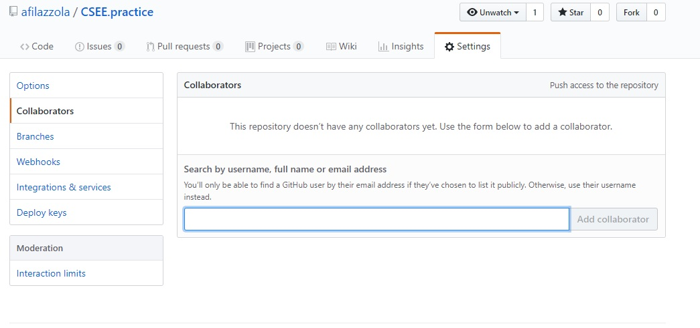
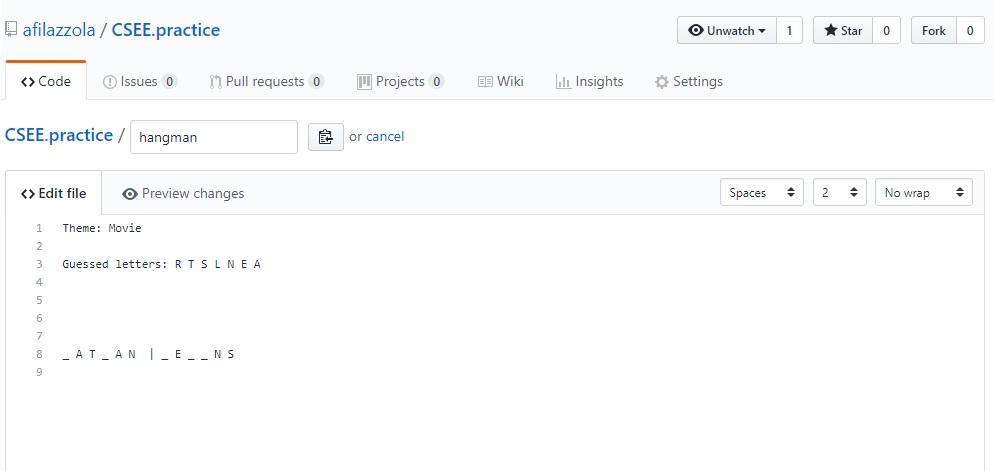

### 1.0 What is Version Control?

Version control shares many similarities with other softwares that you use everyday. Google, Word, even your operating system, operates a form of version control that maintains different version of the same file. Version control is a component of software configuration management and is defined as the management of changes to documents, datasets, scripts, or other files. Put more simply, version control is a way of maintaning and managing different versions of a file you are working on. 

Why you want version control? Well there are many reasons, but here are a few that make it important and worth the effort.

+ Keeps files that you lost (accidentally deleted, hard drive crashed, etc)
+ Allows you to revert changes that caused damage or problems (the ultimate ctrl/cmd+z)
+ Makes collaboration easier
+ Keeps a history of actions to trace your previous work
+ Allows the monitoring of actions to prevent "illegal" data manipulation
+ Provides a widely accessible copy of your work

*But really...* After the first point does it really matter any of the others? I know what some of you might be thinking. With an infallible resource such as Recycling Bin, why would I ever need something like version control? Or some of you more advanced users might think, well I use a back-up drive. Or, what you really all are thinking is that "it won't happen to me". And I am here to say that it can and it will. One thing that many individuals who lose data all have in common is that it was never that much. Rarely are there catastrophic loses of an entire computer without backups. It is usually a few days work or work they collected a day in the field. Realistically if you started a grant in the morning and lost the file half way through the day, wouldn't you be upset? Isn't there an easier way?

With the sales pitch out of the way, Version control keeps a traceable record of your information through a series of steps. Github is a form of version control that, similar to Google drive, offers free data repositories online for you to send your files. The neat thing about Github is that its original design is for saving code, so it has embeded utilities that make it easier for R and Python users or anyone else who is coding. This allows for some added benefits that I can show you towards the end of our workshop. It can also be used for datasets, word documents, and images, but I will not be covering those today.

### 1.1 Creating a Repo

First things first, lets create a repo. To start, we need to go to [Github.com](www.github.com)

After you click on the plus sign (+) in the top right corner of your dashboard on Github you will be brought to a page that looks like the one above. What you need to do here is name your repository with some name that makes sense. The name is case sensitive, does not take spaces, or complex characters. I would recommend using alpha-numeric and periods. The description shown below is optional, but I usually find it good to add at least a sentence here about what the repository is about. If you were doing this for a manuscript or a research project, this is usually where I put the title name. 

You can choose to have this repo as either private or public. As a student, you have unlimited access to private repositories. I keep all my repositories public unless it is unpublished data that I am in the process of publishing. 

Finally, you must initialize the repository with a readme. Your life will be more complicated without one because it is often referenced by the repository as a log of what occurs in the repository. 

Once all that is complete, you will be brought to a page that looks like this, except the repo will have your name infront of it.

You can treat this similar to Google Drive by dragging documents in or by clicking the upload files button. However, lets start more basic and create a simple text file. Click on the create a new file button. 

Name the file "practice" and add some text to the file. Then scroll to the bottom and you will see the following display. It will ask for a commit message. This commit message is necessary to understand for any operation on Github why the file was added, changed, or deleted. Fill this out with something short, simple but informative. 

Once this document has been commited it is stored safely on Github. You can see it on your main screen. You can see it as a list in your commits. You can even comment on the commit if there is an issue you have with it. This is particularly useful when collaborating with someone if you want to understand why they completed a particular operation. 

### 1.2 Creating Issues

Another way to communication to your collaborators is to create an issue. If you click on the issue tab and create issue, you are brought to a page that looks like this. 

Here you write the title of your issue, and a short description that explains what it is. Once you submit it, then it will flag for any collaborators on you repository that it has been submitted. The issue will be label as "open" similar to how a ticket gets submitted to support or IT. A dialogue can be kept on the issue and the issue can be closed once a collaborator feels it has been adequately addressed. We can practice issues more in just a minute. 

### 1.3 Settings and Collaborators

When you click on settings there are loads of options you can implement for your repository. For the most part, you don't need to know most of these things. The only item that is relevant is "branches" that I will talk more on later if we have time. The main items you need to look at in settings is the *Options* tab which has some seriously important stuff. 

Scrolling down, you will see the Github pages section. This allows you to support your repository with its own webpage. Probably my favourite feature in using Github and one I will explain more after the break. For now, I just want to point out that its here.

The next section is the danger zone:

Each of these items are fairly self-explanatory. You may find yourself switching your repository from private to public if the paper that is associated to the repository ends up being published. This is an easy way for you to make your data and code open sourced following its acceptance. You may also choose to archive it at that time so it remains fixed in time with when you finished the paper. All of the items in the danger zone are not reversable and require you to write out the repository name to confirm. You can reverse public to private, but keep in mind that onces it becomes public, it could be duplicated infinitely. 

Now we are going to experiment with collaboration. This is the major selling point of Github that you can share files, follow each others workflow, and commit issues all within a single workspace. I would like you to add someone as a collaborator and to do so, I need you to form groups of two. You can form groups of three if you want, but if that is the case, I would prefer if the third person just watches. It will make it easier for me when I'm explaining. 

### 1.4 Hangman Exercise

Once in your group, pick one person's repository to collaborate with. The person who's repository is going to be used for the exercise we will call them **Person A**. It is now **Person A**'s responsibility to add the other person in the group, **Person B** as a collaborator to the repository. Once **Person B** has been successfully added to **Person A** repo, we should be good to begin the exercise.

**Person A** complete the following steps
- click the new file button
- name the file *"hangman"*
- think of a movie title
- add underscores that match the same number of characters as the movie title
- add a comment and commit

**Person B** Now your turn to complete the following
- refresh the page to see the hangman text file
- click on it to open it
- guess a letter
- add a comment and commit

Continue going back and forth this way to get the movie title. The exercise should look something like this:

