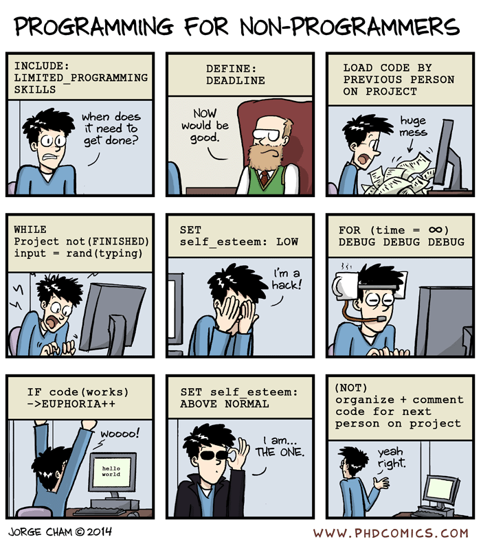
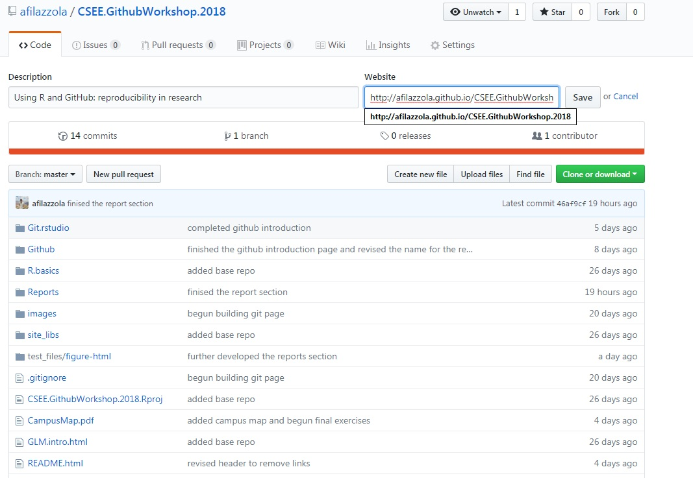

### 4.0 Hosting on Github

The end goal from this workshop is to have a product that is supported online to be a resource for other researchers, your collaborators, and even your future self. Ideally, you will have a completed repository with all the associated data, analyses, and a workflow that includes descriptions of the findings or annotations. The report essentially acts as an Executive Summary providing the summarized information in your analyses and likely what would be included in the manuscript. The datasets you can put into a specified folder so that they can be used for the next person. The readme file can also provide information about the repository and how best to use it. These are just common practices though that I found I use more frequently for my ecology research. You can also use these tools to generate a repository that stores all your code, your plant occurrence datasets (e.g. pictures, GPS coordinates), species lists, lab budgets, or more! The ability to push everything into a safe online repository that can be both public and private, provides a giant opportunity to make your work more accessible.

The final step here is turning your report page into the repositories online document. There are some syntax things that need to be considered when doing this. Previously, Github had an extremely ugly approach for trying to accomplish what we are doing, but thankfully it has been significantly simplfied. The first step is to rename the `XX.html` file that you would like to be the main website for your repository to `index.html`. More recently, whenever I create an `.rmd` file that I know is the main report page for my repository I name it `index.html` to begin with. This way, every time I edit the main `.rmd` file I simply `knit` the page and am good to go without any renaming. Beginning with that, rename the file to `index.html`. Send it online by committing and pushing. 

Next, go online to Github and find your repository. We are going to go under the settings area I showed earlier in the workshop. Click settings, then scroll down to **Github Pages** section. Under source you want to set the master branch to be where Github hosts the website. Save, and then there is one more step.

** Quick Note on Branches ** The reason Github is such a popular choice for programmers is because of certain features. Branches are on of those specific features and you can read about them in detail [here](https://git-scm.com/book/en/v1/Git-Branching-What-a-Branch-Is). The short version is that branch creates a different identifier for when you are commiting files. Developers commonly create a **testing** branch to identify when the code they are adding is experimental vs using the **master** branch for the core operations. This method allows easy roll back when things go wrong. However, for the most part I rarely tend to use branches, despite their popularity. As a general rule of thumb, stay on the master branch.

The final step to getting your website supported is to put the URL in the `Website` section of your repository. The URL can be found under Settings and Github Pages section we were at earlier. However, the syntax is also standard:

> http://YourGithubUsername.github.io/YourRepositoryUsername

Click `Save` and then refresh. Assuming you have checked all three of the settings below, your `index.html` file will now be hosted online and the web address above. 
- Created index.html file
- Set source branch to master and save
- Add website address in website panel




Your report page is now published online. An important rule here is that if your repository is private, the website for your `index.html` page is **NOT**. That means anything in that page can be viewed by the public although the data and other components of your repository are protected. For the most part, I have found this advantageous. It provides an opportuntiy to more openly share results and findings without have to worry about data theft. It does mean though to be a bit more careful with what is placed in the report since certain collaborators have different requirements or ideas on how open the findings should be. 


### 4.1 Aesthetics for your website

R Markdown allows you to make the website have a bit more aesthetics to it. Since Markdown is essentially simplfied HTML you actually have the capacity to use HTML code interchangable, add CSS stylesheets or even more complicated coding such as Javascript or Jekyll.  However, let's assume your expertise does not go beyond R and what has been taught so far in this workshop. We want to pretty up our report page and can do this in the header section of the `.rmd` file. Currently the top of your header section should look like this:

``` 
---
title: "test"
output: html_document
---
```

These two calls state the title of the page and that the knitted output should be an html file. The `---` denotes where the header bigs and ends. This section of document is sensitive to spaces, case, and returns so it needs to be carefully formatted. 

The first thing we would like to add is a theme. The list of supported themes are available [here](https://bootswatch.com/), but can extend beyond the list if you are willing to edit yourself. One of my favourite themes and the one currently used for this repository is *sandstone*. To change the theme of your repository add it below the `html_document` call and include a colon. The format should look like this:

``` 
---
title: "test"
output: 
  html_document:
    theme: sandstone
---
```

Now `Knit` the file and you will the change in text, headers, and formatting. If you wanted your own theme, you could replace that line with `css : styles.css` for a customized stylesheet that you designed. 

The next common feature individuals want is a table of contents. I prefer a floating table of contents that appears in the right panel and allows for easy movement in between relevant sections. The first setting is to set table of contents to true. Here the default *depth* is set to 3, meaning that all headers that are level 3 or less will be included in table of contents. Put another way, any titles you put `###` in front of will appear in the table of contents. This can be changed by manipulating `toc_depth: x`. The final setting is floating table of contents to keep it visible with movement and scrolling through the page. The way this may commonly be set up is as shown below. 

```
---
title: Website
output:
  html_document:
    theme: sandstone
    toc: true
    toc_float: true
---
```

It is also recommend to add in more information into this header. Although it will not affect the file output, it is important for your own records and passing the information to others. I tend to recommend at least including the author(s) names and date the repository was created. 

```
---
title: Website
author: "Alex Filazzola"
date: "July 18 2018"
output:
  html_document:
    theme: sandstone
    toc: true
    toc_float: true
---
```

This area could be used to set defaults for your document. Like we had mentioned earlier about fig dimensions, you may notice that all your figures need to be increased in size. Rather than adding that to each code chunk, you can set it as a deault in this section. 

```
---
title: Website
author: "Alex Filazzola"
date: "July 18 2018"
output:
  html_document:
    theme: sandstone
    toc: true
    toc_float: true
    fig_width: 8
    fig_height: 8
---
```

### 4.2 Shiny Apps

Shiny Apps are the ultimate website version of your analyses. A Shiny App is an online version of your dataset that is interactive and has the potential to be automative. This allows people viewing your data to explore it. There is also the potential to make your analyses automated such that you simple upload a new file and the previous analyse are re-conducted. 

For example, if you had a long-term experiment where you surveyed data every year. You could have an online Shiny App that allows you to upload the new dataset each year and have all the analyses conducted for you. 

Here are some [examples](https://shiny.rstudio.com/gallery/) of Shiny Apps that can all be generated through R.Studio and supported on Github. 

I created a [Shiny App](https://afilazzola.shinyapps.io/climatescanapplication/) for a climate consortium in Ontario that was conducted climate risk scans for local municipalities. The consortium had some fairly complicated calculation of risk based on the survey data provided by the municipalities that they met with. My time with them was contractual so once I had left, there would be no one familiar with my code and likely unable to use it. Instead, I wrote this application within R Studio to conduct the analyses and all they are required to do is upload the survey dataset once it is collected. 

### 4.3 Shiny App Example

Let’s try making a very simple Shiny App. Shiny App’s using slightly different syntax than what we are familiar with, but still require the markdown language and R language we are now familiar with. 

First, we go to file --> new file --> shiny app. This will create a directory with all the shiny files within your current repository. Type in a name for the app and a template Shiny App will be generated. 

Shiny Apps are broken down into two main files that you need to consider. The user interface file (ui.r) and the server file (server.r). The UI is the code for what you are interacting with when you first enter the website or application. The server file is the backend analyses or work that occurs when something is done on the UI. You will now notice a “Run App” option in the top corner. 

Let’s delete all the information that is there and generate a new code. Let’s say we want to plot the mtcars dataset but choose which variables are compared. The trick here is that Apps work as a compiling language. This means that all of it has to work or none of it does. Unlike in normal R where you can run line-by-line to troubleshoot errors, here the error can be anywhere in your code. The trick here then is to build you app one feature and analysis at a time into something fully functional. 

First, we write the code in the server to see the analysis. We can to compare miles per gallon (MPG) among the other different variables.  Under the server we want to create a render plot command. The UI.r and server.r communicate through the `input` and `output` arguments. Thus, the `input` will be what we change in the server side to change the look of the plot and the `output` will be our plot. 

```{r eval=FALSE}
# Define server logic require to create scatter plot of dataset
shinyServer(function(input, output) {
   
  output$plot <- renderPlot({
    var2 <- mtcars[,input$variable]
    plot(mtcars$mpg, var2)
  })
})


```
Here we specify the renderPlot command, describe our second variabl that will change based on the input, and then add that second variable to the plot with `mpg`. 

The key features to remember here is that we specified `input$variable` and `output$plot`. That means in the UI.r we need to describe `variable` and `plot` for those to work in the server side. 

Now we flip to the UI side. Here is what the code looks like

```{r eval=FALSE}

# Define UI for application
shinyUI(fluidPage(
  
  # Sidebar with a slider input for number of bins 
  sidebarLayout(
    sidebarPanel(
    selectInput("variable", "Variable:",
                c("Cylinders" = "cyl",
                  "Transmission" = "am",
                  "Gears" = "gear"))
    ),
    
    # Show a plot of the generated distribution
    mainPanel(
       plotOutput("plot")
    )
  )
  ))

```

Take a look specifically at the `selectInput` command. The first argument is our `variable` call from the server and is what connects the user input to the function we wrote on the server side. The "Variable:" is just a text description for the user to understand what the dropdown input menu is doing. Then final arguments are what the options will be here. We have taken the column headings from the `mtcars` dataset. The text infront is again just to make it easier for the user. 

The final item is to make the plot. That part is simple with calling `plotOutput` and the `plot` output from our server.The rest of the code here is to pretty up our User Interface by generating a side panel. 

Unforatuntely, Shiny Apps because they are interactive are not supported through the webpage option on Github. However, [Shiny](https://www.shinyapps.io/) themeselves allow you to put your App on their website once you set up an account. They allow free hosting with some limitations. That is currently where my climate application resides.